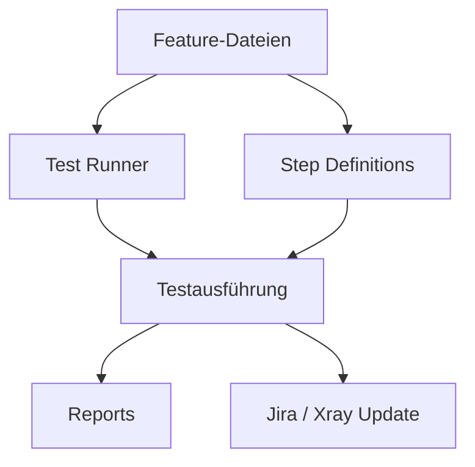

# ATAF-Dokumentation

Dieses Handbuch ist die zentrale Anlaufstelle auf [GitHub Pages](https://it-at-m.github.io/agile-test-automation-framework/). Es wird mit dem Repository (`main`) versioniert.

- **GitHub-Repository**: [https://github.com/it-at-m/agile-test-automation-framework/](https://github.com/it-at-m/agile-test-automation-framework/)
- **Aktuelle Releases**: [github.com/it-at-m/agile-test-automation-framework/releases](https://github.com/it-at-m/agile-test-automation-framework/releases) (ersetzt einen Changelog im Repository)
- **Maven-Koordinaten**: `de.muenchen.ataf:{core,rest,web}` auf Maven Central

## Schnellzugriff

- [Projektgeschichte](./overview/project-history.md) – wie ATAF entstanden ist und wo es heute eingesetzt wird
- [Releases](./overview/releases.md) – Versionierung und wie Artefakte veröffentlicht werden
- [Voraussetzungen](./getting-started/prerequisites.md)
- [Installation](./getting-started/installation.md) – Maven-Abhängigkeiten hinzufügen
- [Build und Integrationstests](./getting-started/build.md) – `mvn clean package`, JIRA-gesteuerte Tests
- [Tests schreiben](./usage/writing-tests.md) – Cucumber + TestNG/JUnit
- [Runner und Testausführung](./usage/runners.md)
- [Umgebungen und Systeme](./usage/environments.md)
- [Property-Dateien](./configuration/properties.md)
- [Laufzeit-Zugangsdaten](./configuration/credentials.md)
- [Reporting](./reporting.md)

## Über ATAF

Das **Agile Test Automation Framework (ATAF)** ist ein robustes, flexibles Java-21-Framework für automatisiertes Testen. Es vereinfacht BDD-Tests mit Cucumber neben klassischen TestNG- und JUnit-Testsuites und unterstützt die Anbindung an Jira und Xray über deren REST-APIs.

ATAF ist für agile Projekte gedacht: schnelle Einrichtung, wartbare Testautomatisierung und Integration in moderne Entwicklungs-Workflows. Neben Browser- und API-Tests bietet es Hooks für die Verwaltung von Testausführungen in Jira/Xray.

### Was ATAF bietet

- Unterstützung sowohl für BDD-Tests mit Cucumber als auch für klassische Testfälle mit TestNG und JUnit.
- Nahtlose Integration in verbreitete Test-Bibliotheken.
- Einfach konfigurierbare Runner für TestNG und JUnit.
- Anbindung an Jira und Xray über deren REST-APIs für das Testmanagement.

### Modulaufbau

ATAF ist in drei Artefakte unter der Maven-Gruppe `de.muenchen.ataf` aufgeteilt:

- `core` – erforderlich. Cucumber- und Jira-Anbindung, Testdaten-Helfer, Properties-Utilities.
- `rest` – optional. Klassen für API-Tests.
- `web` – optional. Klassen für Browser-Tests.

Siehe [Installation](./getting-started/installation.md) für die genauen Maven-Koordinaten und Snippets.

### Verwendete Technologien

Dieses Projekt baut auf etablierten Technologien für moderne Java-basierte Testautomatisierung auf:

- [Java 21](https://www.oracle.com/java/)
- [Maven](https://maven.apache.org/)
- [Cucumber](https://cucumber.io/)
- [TestNG](https://testng.org/)
- [JUnit 5](https://junit.org/junit5/)
- [Selenium](https://www.selenium.dev/)
- [Log4j 2](https://logging.apache.org/log4j/2.x/)
- Jira REST API
- Xray REST API

### Ablauf auf hoher Ebene

### Lizenz

Veröffentlicht unter der [MIT-Lizenz](https://github.com/it-at-m/agile-test-automation-framework/blob/main/LICENSE).

## Kontakt

[Übersicht](https://opensource.muenchen.de/)

Münchner Kontakt: it@M – opensource@muenchen.de

ATAF wurde überwiegend von Kolleg:innen aus **digital@M** für den Einsatz bei **it@M**, dem IT-Dienstleister der Landeshauptstadt München, entwickelt. Die ausführliche Geschichte findet sich unter [Projektgeschichte](./overview/project-history.md).

<table border="0" cellpadding="0" cellspacing="0">
  <tr>
    <td style="padding-right: 30px;"></td>
    <td style="padding-right: 30px;"></td>
    <td></td>
  </tr>
</table>
