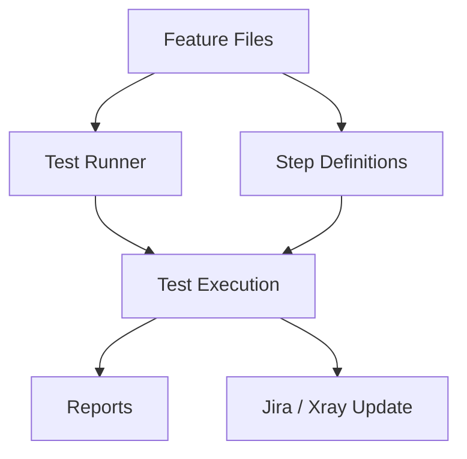

# ATAF Documentation

This handbook is the main entry point on [GitHub Pages](https://it-at-m.github.io/agile-test-automation-framework/). It is versioned with the repository (`main`).

- **GitHub Repository**: [https://github.com/it-at-m/agile-test-automation-framework/](https://github.com/it-at-m/agile-test-automation-framework/)
- **Latest releases**: [github.com/it-at-m/agile-test-automation-framework/releases](https://github.com/it-at-m/agile-test-automation-framework/releases) (used in place of an in-repo changelog)
- **Maven coordinates**: `de.muenchen.ataf:{core,rest,web}` on Maven Central

## Quick Links

- [Project History](./overview/project-history.md) — how ATAF started and where it's used today
- [Releases](./overview/releases.md) — versioning and how artifacts are published
- [Prerequisites](./getting-started/prerequisites.md)
- [Installation](./getting-started/installation.md) — add the Maven dependencies
- [Build and Integration Tests](./getting-started/build.md) — `mvn clean package`, JIRA-gated tests
- [Writing Tests](./usage/writing-tests.md) — Cucumber + TestNG/JUnit
- [Runners and Running Tests](./usage/runners.md)
- [Environments and Systems](./usage/environments.md)
- [Property Files](./configuration/properties.md)
- [Runtime Credentials](./configuration/credentials.md)
- [Reporting](./reporting.md)

## About ATAF

The **Agile Test Automation Framework (ATAF)** is a robust, flexible Java 21 framework for automated testing. It simplifies BDD-style testing with Cucumber alongside traditional TestNG and JUnit test suites, and supports integration with Jira and Xray via their REST APIs.

ATAF is designed for agile projects: fast setup, maintainable test automation, and integration into modern development workflows. In addition to browser-based and API testing, it provides hooks for managing test executions in Jira/Xray.

### What ATAF Provides

- Support for both BDD testing with Cucumber and traditional test cases with TestNG and JUnit.
- Seamless integration with popular testing libraries.
- Easy-to-configure runners for TestNG and JUnit.
- Integration with Jira and Xray using their existing REST APIs for test management.

### Module Layout

ATAF is split into three artifacts under the `de.muenchen.ataf` Maven group:

- `core` — required. Cucumber and Jira integration, test data helpers, properties utilities.
- `rest` — optional. Classes for API testing.
- `web` — optional. Classes for browser-based tests.

See [Installation](./getting-started/installation.md) for the exact Maven coordinates and snippets.

### Built With

This project is built with technologies commonly used in modern Java-based test automation:

- [Java 21](https://www.oracle.com/java/)
- [Maven](https://maven.apache.org/)
- [Cucumber](https://cucumber.io/)
- [TestNG](https://testng.org/)
- [JUnit 5](https://junit.org/junit5/)
- [Selenium](https://www.selenium.dev/)
- [Log4j 2](https://logging.apache.org/log4j/2.x/)
- Jira REST API
- Xray REST API

### High-Level Flow

### License

Distributed under the [MIT License](https://github.com/it-at-m/agile-test-automation-framework/blob/main/LICENSE).

## Contact

[Overview](https://opensource.muenchen.de/)

Munich contact: it@M – opensource@muenchen.de

ATAF was built primarily by colleagues from **digital@M** for use at **it@M**, the IT service provider of the Landeshauptstadt München. See [Project History](./overview/project-history.md) for the full story.

<table border="0" cellpadding="0" cellspacing="0">
  <tr>
    <td style="padding-right: 30px;"></td>
    <td style="padding-right: 30px;"></td>
    <td></td>
  </tr>
</table>
